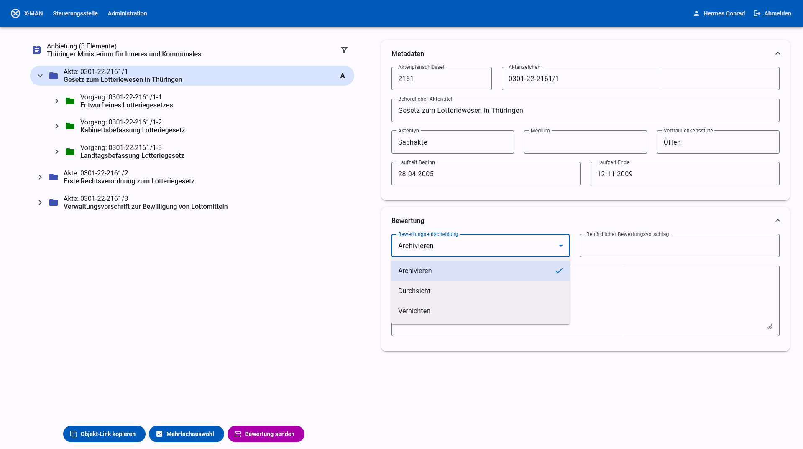

# xdomea-Aussonderungsmanager

Der xdomea-Aussonderungsmanager (kurz x-man) ermöglicht die Ansicht, Bewertung und Archivierung von E-Akten in Form von xdomea Aussonderungsnachrichten.

Die Nutzeroberfläche wird als Webanwendung ausgeliefert und funktioniert in allen modernen Browsern.
Die Anwendung kommuniziert über automatisierte Schnittstellen mit externen Diensten und die Bedienung geschieht medienbruchfrei in der Anwendung.

Hauptfunktionen:

- Annahme von Aussonderungen und Austausch von Nachrichten mit abgebenden Stellen nach dem [xdomea-Standard](https://www.xrepository.de/details/urn:xoev-de:xdomea:kosit:standard:xdomea) (Versionen 2.3 bis 3.1)
- Ansicht und Bewertung von Anbietungen in der Weboberfläche
- Datei-Validierung mit Hilfe von [BorgFormat](https://github.com/Landesarchiv-Thueringen/borg)
- Import von Abgaben in das [DIMAG Kernmodul](https://gitlab.la-bw.de/dimag/core/kernmodul) für die dauerhafte Archivierung

Ergänzende Funktionen:

- Erstellen eines Übernahmeberichtes nach erfolgreicher Archivierung
- E-Mail-Benachrichtigungen bei neuen xdomea-Nachrichten oder im Fehlerfall
- Nutzerverwaltung über ein bestehendes LDAP / Active Directory
- Administration und Fehlerbehandlung durch gesonderte Administratoren
- Zuordnung von Archivarinnen zu abgebenden Stellen

## Bedienung

Siehe

- [Benutzerhandbuch für Archivarinnen](./doc/User-Manual_DE.md)
- [Benutzerhandbuch für Administratoren](./doc/Administration-Manual_DE.md)

## Installation

Siehe [Installation (en)](./doc/Installation.md).

## Entwicklung

Siehe [Development (en)](./doc/Development.md).

## Roadmap

- AFIS-Schnittstelle
- DIMAG-Bagit

## Lizenz

Dieses Projekt wird unter der [GNU General Public License Version 3 (GPLv3)](https://www.gnu.org/licenses/gpl-3.0.de.html) veröffentlicht.
