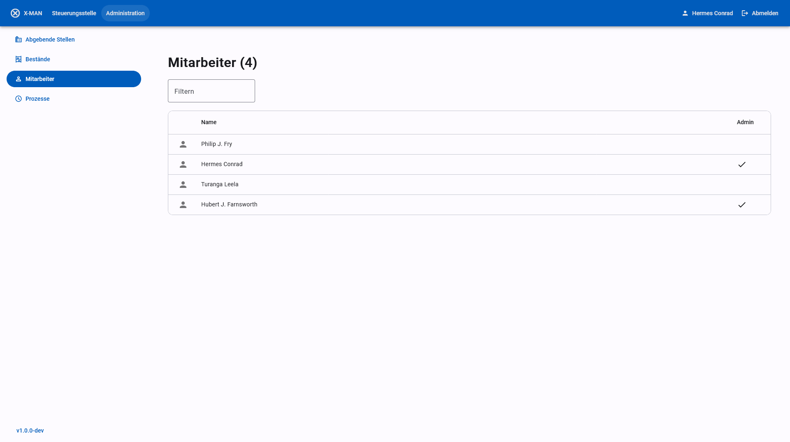

# Benutzerhandbuch für Administratoren

## Betrieb

Der xdomea-Aussonderungsmanager (kurz x-man) wird in einer Docker-Umgebung auf einem Linux-System betrieben und mit Umgebungsvariablen konfiguriert. Siehe [Installation (en)](./Installation.md) für weitere Informationen.

## Funktionsweise

Für eine kurze Beschreibung der Anwendung und ihrer Funkionen siehe [Readme](../README.md).

## Nachrichtenaustausch mit xdomea

**Transferverzeichnisse.** Der Austausch von Nachrichten geschieht über konfigurierte Transferverzeichnisse (siehe [Administration](#administration)). Ein Transferverzeichnis kann entweder über das lokale Dateisystem oder als WebDAV-Freigabe eingebunden werden. Konfigurierte Transferverzeichnisse werden von x-man automatisch regelmäßig auf neue Nachrichten überprüft. Wird eine Nachricht gefunden, wird sie automatisch eingelesen und verarbeitet. Auf der anderen Seite erstellt x-man selbst Nachrichten, die im Aussonderungsverfahren von xdomea vorgesehen sind (Bewertungsnachricht, diverse Empfangs- bzw. Importbestätigungen), und überträgt diese in die Transferverzeichnisse.

**Datenhaltung.** Nach dem Auffinden einer neuen Nachricht verarbeitet x-man diese für die weitere Verwendung. Daten zur Nachricht befinden sich an verschiedenen Stellen und sollten synchron gehalten werden um Fehler zu vermeiden (z.B. beim Wiederherstellen eines Backups gemeinsam wiederhergestellt werden). Alle Daten werden von x-man selbst verwaltet und erfordern im normalen Betrieb keinen manuellen Zugriff.

- Transferverzeichnis: Nach dem initialen Einlesen greift x-man zunächst nicht mehr auf die eingelesene Datei im Transferverzeichnis zu, jedoch löscht es Nachrichten nach der erfolgreichen Archivierung und dem Ablaufen einer Frist aus der Anwendung und entfernt dabei auch die zugehörigen Dateien aus dem Transferverzeichnis.
- Datenbank: x-mans interne Datenhaltung erfolgt durch eine Postgres-Datenbank. Neben dem Inhalt von xdomea-Nachrichten wird hier auch die Konfiguration der Anwendung und der Bearbeitungszustand von Aussonderungen gespeichert. Die zugehörigen Daten werden in der vorgeschlagenen Docker-Compose-Konfiguration in einem Docker-Volume abgelegt.
- Message-Store: Primärdaten werden von x-man direkt in einem Dateisystem verwaltet. Auch der Message-Store wird in der der vorgeschlagenen Docker-Compose-Konfiguration als Docker-Volume angelegt.

**Validitätsprüfung.** Empfangene Nachrichten werden von x-man auf Validität und Korrektheit geprüft. Bei gefundenen Fehlern wird ein Problem-Eintrag für die Steuerungsstelle angelegt (siehe [Fehlerbehandlung](#fehlerbehebung)). Geprüft wird:

- Validität der Nachricht nach dem xdomea-Standard durch eine XML-Schemaprüfung
- Inhalt der Nachricht im Kontext eines laufenden Aussonderungsprozesses, insbesondere Abgaben bei vorangegangener Bewertung einer Anbietung
- Maximale Verschachtlungstiefe nach Einstellung von `XDOMEA_MAX_RECORD_OBJECT_DEPTH`. In der aktuellen Version sieht xdomea eine maximale Verschachtlungstiefe von 5 Ebenen vor, jedoch darf der Wert in Absprache zwischen Archiven und abgebenden Stellen verändert werden.

## Bewertung von Anbietungen

Empfangene Anbietungen können von Archivarinnen bewertet werden. x-man erlaubt die Bewertung auf Akten- und Vorgangsebene sowie die Einschränkung der Bewertung auf Wurzelelemente der Anbietung. Das Verhalten kann mit der Umgebungsvariable `APPRAISAL_LEVEL` eingestellt werden.

## Archivierung mit dem DIMAG Kernmodul

x-man kann zur dauerhaften Archivierung an das DIMAG Kernmodul angebunden werden. Die Konfiguration geschieht über Umgebungsvariablen mit dem Präfix `DIMAG`. Ggf. ist das hinzufügen von Zertifikaten für die verschlüsselte Kommunikation nötig (siehe [Zertifikate](#zertifikate)). Das Mapping der Daten ist durch die Anwendung vorgegeben und kann nicht konfiguriert werden.

Alternativ ist die Archivierung in ein lokales Dateisystem möglich. Das Verhalten wird über die Variable `ARCHIVE_TARGET` gesteuert. Diese Art der Archivierung folgt keiner standardisierten Form und ist zu Test-Zwecken oder als Übergangslösung gedacht.

## Automatisches Löschen von Aussonderungen

x-man ist ein Durchgangssystem, das Daten nicht dauerhaft vorhält. Entsprechend werden die zugehören Daten zu Aussonderungen nach der erfolgreichen Archivierung nach dem Ablauf einer Frist automatisch gelöscht. Diese Frist kann mit der Umgebungsvariable `DELETE_ARCHIVED_PROCESSES_AFTER_DAYS` in Tagen bestimmt werden.

## Nutzerverwaltung mit LDAP

Die Nutzerverwaltung von x-man geschieht über ein LDAP-System wie Active Directory. x-man greift dabei nur lesend auf ein bestehendes System zu. Die Konfiguration geschieht über Variablen mit dem Präfix `LDAP`. Ggf. ist das hinzufügen von Zertifikaten für die verschlüsselte Kommunikation nötig (siehe [Zertifikate](#zertifikate)). Neben einem fest-konfigurierten Nutzer für den Zugriff auf Nutzerlisten und Gruppen ist die Konfiguration von zwei LDAP-Gruppen erforderlich:

- `LDAP_ACCESS_GROUP`: Mitglieder der als Wert eingetragenen Gruppe können sich in x-man anmelden und ihnen können abgebende Stellen zugewiesen werden.
- `LDAP_ADMIN_GROUP`: Mitglieder der als Wert eingetragenen Gruppe können sich mit Administrations-Rechten in x-man anmelden. Sie haben alle Befugnisse der Mitglieder der Access-Group und können zusätzlich Fehler in der Steuerungsstelle einsehen und beheben sowie die Laufzeit-Konfiguration der Anwendung steuern (siehe [Fehlerbehandlung](#fehlerbehebung) und [Administration](#administration)).

Bei der Anmeldung von Nutzern stellt x-man sogenannte Bearer Tokens aus, die vom Webbrowser gespeichert werden. Die Länge der Gültigkeit dieser Tokens sowie ein geheimer Wert, der zur Erstellung und Prüfung der Tokens dient wird über die Umgebungsvariablen mit dem Präfix `TOKEN` gesteuert.

## Zertifikate

Bei der verschlüsselten Kommunikation mit externen Diensten (z.B. LDAP, DIMAG, SMTP, Borg) werden Zertifikate zur Authentifizierung des externen Dienstes genutzt. x-man greift dabei auf die konfigurierten Wurzelzertifikate der Linux-Umgebung zurück. Das ist bei einem Betrieb per Docker der Docker-Container des Backend-Servers. Für den Fall, dass externe Dienste über ein öffentlich gültiges Zertifikat verfügen, ist kein weiteres Zutun erforderlich. Falls Dienste jedoch selbst signierte oder interne Zertifikate verwenden, muss die Zertifikatskette für x-man zugänglich gemacht werden. Dazu kopieren Sie alle Zertifikate, die genutzt werden um Zertifikate externer Dienste zu signieren, in den Ordner `server/data/ca-certificates` und wiederholen Sie die Schritte um Docker-Images zu bauen und zu starten wie in [Installation](Installation.md) beschrieben. Zertifikate sollten die Dateiendung `.crt` haben und im PEM-Format folgender Form vorliegen:

```
-----BEGIN CERTIFICATE-----
[...]
-----END CERTIFICATE-----
```

## E-Mail-Benachrichtigungen

x-man erlaubt die Benachrichtigung von Nutzern bei neuen xdomea-Nachrichten oder abgeschlossenen Prozessen, sowie von Administratoren bei neuen Fehlern. Dazu muss ein SMTP-Server konfiguriert werden. Dies geschieht über Umgebungsvariablen mit dem Präfix `SMTP`. Ggf. ist das hinzufügen von Zertifikaten für die verschlüsselte Kommunikation nötig (siehe [Zertifikate](#zertifikate)).

E-Mail-Adressen werden den Nutzereinträgen aus LDAP entnommen und sind nicht konfigurierbar. Nutzer und Administratoren haben jedoch die Möglichkeit in der Anwendung, E-Mail-Benachrichtigungen für sich selbst zu aktivieren und deaktivieren.

## Formatverifikation

x-man unterstützt die automatische Formatverifikation mit dem Tool [BorgFormat](https://github.com/Landesarchiv-Thueringen/borg). Die Konfiguration geschieht über die Umgebungsvariable `BORG_ENDPOINT`. Ggf. ist das hinzufügen von Zertifikaten für die verschlüsselte Kommunikation nötig (siehe [Zertifikate](#zertifikate)).

Im Fall von negativen Ergebnissen wird für die Abgabe ein Fehler in der Steuerungsstelle erzeugt (siehe [Fehlerbehandlung](#fehlerbehebung)).

## Administration

Nutzer, die der Gruppe für Administratoren angehören (siehe [Nutzerverwaltung mit LDAP](#nutzerverwaltung-mit-ldap)), können über die Weboberfläche von x-man auf das Administrations-Panel zugreifen. Hier stehen verschiedene Ansichten für die Anpassung von Laufzeit-Konfiguration und die Einsicht in den laufende Prozesse der Anwendung zur Verfügung. Konfiguration, die mit Umgebungsvariablen gesteuert wird, kann hier jedoch nicht angepasst werden.

### Abgebende Stellen


Hier können die abgebenden Stellen konfiguriert werden, die Schriftgutobjekte an das Archiv aussondern. Die folgenden Daten können eingestellt werden:

- **Name** und **Kürzel** werden in der Anwendung angezeigt und in den Übernahmebericht übernommen, um die abgebende Stelle zu identifizieren.
- **Behördenkennung** (Präfix und Behördenschlüssel) wird mit den Daten von empfangenen xdomea-Nachrichten abgeglichen. Bei Nichtübereinstimmung wird ein Fehler für die Steuerungsstelle erzeugt.
- **Zuordnung zu Bestand** ist die Vorauswahl für den DIMAG-Bestand, in den die Abgaben der abgebenden Stelle standardmäßig für die dauerhafte Archivierung übertragen werden. Der Bestand kann bei der Archivierung durch die Archivarin angepasst werden, die hier eingestellte Vorauswahl bleibt davon jedoch unverändert.
- **Zuordnung zu Mitarbeiter** bestimmt, welche Nutzer die Aussonderungen der abgebenden Stelle in ihrer Aussonderung-Liste sehen und bei neuen Nachrichten per E-Mail benachrichtigt werden. Administratoren haben die Möglichkeit, in der Aussonderungs-Liste auch Aussonderungen von abgebenden Stellen anzuzeigen, die ihnen nicht zugeordnet sind.
- **Kontakt** ermöglicht das Speichern einer E-Mail-Adresse, an die bei Fehlern E-Mails an die abgebende Stelle gesendet werden können. x-man stellt Vorlagen für E-Mails bereit, auf deren Grundlage Administratoren E-Mails verfassen können, sendet jedoch nicht eigenständig E-Mails an abgebende Stellen.
- **Transferverzeichnis** ist ein Ordner auf dem lokalen Dateisystem oder eine WebDav-Freigabe, der/die zur Übertragung von xdomea-Nachrichten genutzt wird. Abgebende Stellen sowie x-man legen Nachrichten in Form von Zip-Dateien nach dem xdomea-Standard in dieses Verzeichnis ab, um sie von der Gegenseite abholen zu lassen. x-man überprüft selbstständig regelmäßig die hier konfigurierten Transferverzeichnisse auf neue Nachrichten. Nach abgeschlossener Archivierung und dem Verstreichen einer einstellbaren Frist löscht x-man sowohl die von x-man selbst erstellten, wie auch die von der abgebenden Stelle empfangenen Nachrichten aus dem Transferverzeichnis.

### Bestände


Hier werden die DIMAG-Bestände eingetragen, in die Abgaben archiviert werden. Da das DIMAG Kernmodul nicht über eine Schnittstelle verfügt, über die Namen von Beständen abgerufen werden können, müssen die Bestände von DIMAG von einem Administrator von Hand zu x-man übertragen werden. Bestände können nur in DIMAG selbst angelegt oder bearbeitet werden. Die Einstellungen auf dieser Seite dienen nur dazu, die Konfiguration von DIMAG nachzubilden.

### Mitarbeiter



Hier können die Nutzer, die vom LDAP-System abgerufen werden, eingesehen werden. x-man erlaubt keine eigene Nutzerverwaltung und zeigt lediglich die vom LDAP-System vorgegebenen Daten. In der Liste sind nur Nutzer aufgeführt, die durch ihre Gruppenzugehörigkeit Zugriffsrechte auf das System haben (sieh [Nutzerverwaltung mit LDAP](#nutzerverwaltung-mit-ldap)).

### Prozesse


Hier werden laufende Prozesse des x-man Servers angezeigt. Die Ansicht erlaubt zur Zeit kein Einflussnahme auf laufende oder abgeschlossene Prozesse und dient nur der Nachvollziehbarkeit.

## Fehlerbehebung


Für Administratoren ist zusätzlich der Bereich "Steuerungsstelle" sichtbar. Hier werden Fehler bei der Verarbeitung von xdomea-Nachrichten und anderen Aufgaben aufgelistet. Allgemein wird die Bearbeitung durch die Archivarin beim Auftreten von Fehlern unterbrochen, bis der Fehler durch die Steuerungsstelle ausgeräumt ist. Bei Fehlern in xdomea-Nachrichten kann die Zusammenarbeit mit der abgebenden Stelle erforderlich sein, um den Fehler auszuräumen. Administratoren haben außerdem die Möglichkeit, einen Fehler "als gelöst [zu] markieren", um ein Fortsetzen der Bearbeitung zu erlauben, oder die gesamte xdomea-Nachricht zu löschen.

Neben gezielt gefundenen Fehlern werden auch unerwartete Anwendungsfehler in der Steuerungsstelle angezeigt. Diese Fehler sind nicht mit einer Aussonderung verbunden, aber können zu einem inkonsistenten Zustand der Anwendung führen. Eine direkte Behandlung solcher Fehler durch x-man ist nicht möglich. Anwendungsfehler können z.B. durch eine fehlerhafte Konfiguration oder Probleme im Betrieb wie Netzwerkfehlern ausgelöst werden. In diesen Fällen kann das Problem ggf. extern gelöst werden. Eine weitere Ursache können Programmierfehler in der Anwendung selbst sein. Wenn Sie glauben, solche Fehler zu beobachten, würden wir uns über Rückmeldung in Form eines Github-Issues freuen: https://github.com/Landesarchiv-Thueringen/x-man/issues.
