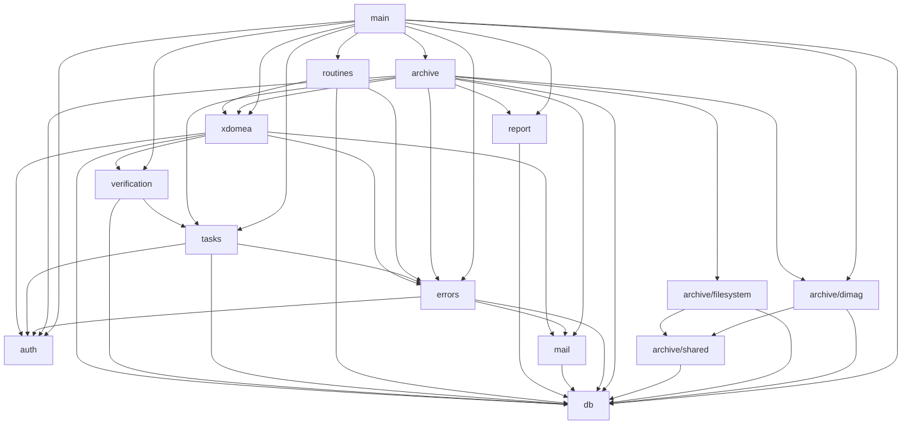

# Architecture

## Server

### Package Layout

```mermaid
graph TD;
    main-->archive
    main-->archive/dimag
	main-->auth
	main-->db
	main-->errors
	main-->report
	main-->routines
	main-->tasks
	main-->verification
	main-->xdomea
    archive/dimag-->db
    archive/dimag-->archive/shared
    archive/filesystem-->db
    archive/filesystem-->archive/shared
    archive/shared-->db
	archive-->archive/dimag
	archive-->archive/filesystem
	archive-->auth
	archive-->db
	archive-->errors
	archive-->mail
	archive-->report
	archive-->tasks
	archive-->xdomea
    errors-->auth
	errors-->db
	errors-->mail
    mail-->db
    report-->db
    routines-->db
	routines-->errors
	routines-->xdomea
    tasks-->auth
    tasks-->errors
	tasks-->db
    verification-->db
    verification-->tasks
	xdomea-->auth
	xdomea-->db
	xdomea-->errors
	xdomea-->mail
	xdomea-->verification
```
