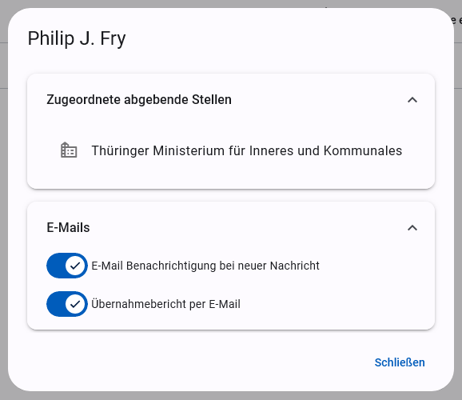
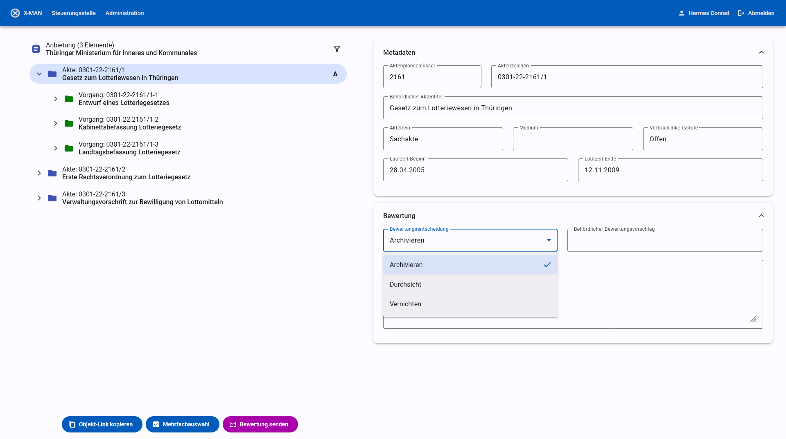
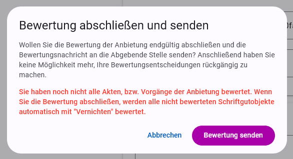
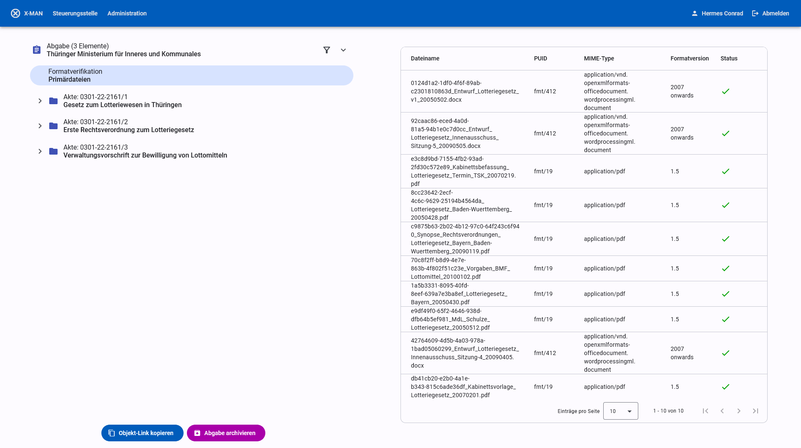

# Benutzerhandbuch

Für eine kurze Beschreibung der Anwendung und ihrer Funkionen siehe [Readme](../README.md).

**Die Anwendung.** Der xdomea-Aussonderungsmanager (kurz x-man) wird als Webanwendung bereitgestellt. Die Bedienung erfolgt vollständig über die Web-Oberfläche, so dass Sie Dateien nur in Ausnahmefällen oder zur manuellen Überprüfung herunterladen müssen. Die Web-Oberfläche aktualisiert sich selbstständig bei eingehenden Nachrichten und abgeschlossenen Prozessen.

**Kommunikation mit der abgebenden Stelle.** Die Kommunikation zwischen x-man und abgebenden Stellen geschieht mittels Nachrichten gemäß dem xdomea-Standard. Die Nachrichten werden über Transferverzeichnis ausgetauscht. x-man empfängt, verarbeitet, erstellt und versendet selbstständig Nachrichten von und an abgebende Stellen.

**Langzeitarchivierung in einem digitalen Magazin.** x-man ist an ein digitales Magazin zur Langzeitarchivierung angebunden. Der Archivierungsprozess wird nach dem Starten durch die Archivarin automatisiert durchgeführt. x-man unterstützt die Archivierung in DIMAG und in ein lokales Verzeichnis.

**Bildung der Archivpakete.** Die Archivpakete werden für Schriftgutobjekte auf der Wurzelebene der Abgabenachricht gebildet. Für jede Akte bzw. für jeden Vorgang auf Wurzelebene wird ein Archivpaket erstellt. Falls es in der Abgabe Dokumente gibt, die keiner Akte oder keinem Vorgang zugeordnet sind, wird für alle diese Dokumente ein gemeinsames Archivpaket erstellt.  
Ein Archivpaket enthält alle Primärdateien, der zugehörigen Schriftgutobjekte, eine Protokolldatei und die gekürzte Abgabenachricht. Alle Schriftgutobjekte die nicht zum Archivpaket gehören werden automatisch aus der Abgabenachricht entfernt. Der Titel und die Laufzeit der Archivpakete werden aus den Metadaten der zugehörigen Schriftgutobjekte gebildet.

**Protokollierung von Ereignissen und Fehlern.** Die wichtigsten Ereignisse und Fehler werden dem Archivpaket in einer Textdatei beigelegt. In DIMAG wird die Protokolldatei als Primärdatei angelegt. Eine Übernahme als Protokoll nach DIMAG wird zurzeit nicht unterstützt.

**Anmeldung.** Sie sollten Zugang zu x-man über Ihre üblichen Windows-Login-Daten erhalten. Sollte der Zugang nicht funktionieren, wenden Sie sich bitte an einen Administrator. Nach erfolgreicher Anmeldung sehen sie Ihren Namen in der Titel-Leiste am oberen Rand der Web-Anwendung. Hier können Sie sich jederzeit wieder abmelden.

**Einstellungen und E-Mail-Benachrichtigungen.** Durch Anklicken Ihres Namens in der Titel-Leiste gelangen Sie zu ihren Nutzer-Informationen und -Einstellungen. Abgebende Stellen werden durch Administratoren zugeordnet. Sie haben die Möglichkeit E-Mail-Benachrichtigungen zu erhalten, wenn eine neue Nachricht einer Ihnen zugeordneten abgebenden Stelle eingegangen oder eine von Ihnen gestartete Archivierung abgeschlossen ist.

## Aussonderungs-Liste

Die Hauptansicht nach dem Einloggen listet alle empfangenen Aussonderungen für den angemeldeten Nutzer. Der Tabelle kann der Bearbeitungszustand der jeweiligen Aussonderung entnommen werden.

- Beispiel 1: Eine Anbietung ist von der abgebenden Stelle eingegangen und wurde bereits teilweise durch die Archivarin bewertet.
- Beispiel 2: Die Archivarin hat die Bewertung abgeschlossen und zurück an die abgebende Stelle gesendet. Die abgebende Stelle hat dem Empfang der Bewertung bestätigt.
- Beispiel 3: Zusätzlich zu den Schritten der oberen Beispiele hat die abgebende Stelle auf Grundlage der erhaltenen Bewertung die Abgabe erstellt und übermittelt. x-man hat automatisiert die Formatverifikation für alle enthaltenen Dateien durchgeführt.
- Beispiel 4: Nach den oberen Schritten hat die Archivarin die dauerhafte Archivierung der Abgabe veranlasst. Die Bearbeitung der Aussonderung in x-man ist abgeschlossen und die Aussonderung wird in einigen Tagen automatisch aus der Liste entfernt.
- Beispiel 5: Die abgebende Stelle hat eine Anbietung übermittelt, in der x-man einen technischen Fehler festgestellt hat. Die Aussonderung wird einem Mitarbeiter der Steuerungsstelle vorgelegt, der dich ggf. mit der abgebenden Stelle in Verbindung setzt, um das Problem zu lösen. Wenn das Problem gelöst ist, wird die Aussonderung wieder zur Bearbeitung durch die Archivarin freigegeben.
- Beispiel 6: In Absprache mit der abgebenden Stelle wurde eine Abgabe im zweistufigen Verfahren übermittelt. Zur Zeit findet die automatische Formatverifikation durch x-man statt. Sobald diese erfolgreich abgeschlossen ist, kann die Abgabe archiviert werden. Eine Bewertung ist hier nicht möglich.

**Arbeitstitel.** Der Arbeitstitel kann frei von Ihnen vergeben werden. Er dient lediglich zum leichteren Auffinden der Aussonderung in der Liste und wird nicht weiter verarbeitet. Der Arbeitstitel kann in der Nachrichten-Ansicht jederzeit geändert werden.

**Sortierung.** Die Tabelle nach dem Inhalt beliebiger Spalten sortiert werden. Die Sortierung wird durch Klicken der Spaltenüberschriften eingestellt. Mehrfaches Klicken ändert die Reihenfolge (auf- / absteigend). Die aktuelle Sortierung wird durch einen Pfeil neben der Spaltenüberschrift angezeigt (im Beispiel aufsteigend nach Arbeitstitel).

**Filtern.** Mit einem Klick auf den Button "Filtern" im oberen Bereich der Seite wird eine Filterleiste eingeblendet. Mit Hilfe der Filterleiste können Aussonderungen in der Liste nach freiem Text, der auf den Namen der abgebenden Stelle und auf den Arbeitstitel angewendet wird, nach abgebender Stelle und/oder nach aktuellem Bearbeitungsstand gefiltert werden.

Durch Klicken auf eine Zeile in der Aussonderungs-Liste gelangen Sie zur Nachrichten-Ansicht. Durch einen Klick auf die "X-MAN" beschriftete Schaltfläche oben links kehrt er jederzeit zurück zur Aussonderungs-Liste.

## Nachrichten-Ansicht

### Nachrichten in xdomea

Die Nachrichten-Ansicht zeigt den Inhalt einer Nachricht nach dem xdomea-Standard. Im Rahmen einer Aussonderungen werden verschiedene xdomea-Nachrichten zwischen der abgebenden Stelle und dem Archiv ausgetauscht. Einige dieser Nachrichten erstellt oder verarbeitet x-man ohne weiteres Zutun des Nutzers. Zwei Typen von Nachrichten werden jedoch in der Nachrichten-Ansicht angezeigt:

**Anbietung.** Die Anbietung ist eine Liste von angebotenen Schriftgutobjekten, die von der abgebenden Stelle zusammengestellt wird. Die enthält keine Primärdaten. In der Nachrichten-Ansicht können Sie die Metadaten der Schriftgutobjekte betrachten. Schließlich bewerten Sie die angebotenen Schriftgutobjekte und übermittelt die Bewertung an die abgebende Stelle.

**Abgabe.** Nach erhaltener Bewertung, oder – nach Verabredung mit der abgebenden Stelle – ohne vorangegangenen Austausch übermittelt die abgebende Stelle die Abgabe aller zu archivierenden Schriftgutobjekte mitsamt der Primärdaten. Die Primärdaten werden von x-man automatisch mit einer Formatverifikation überprüft. In der Nachrichten-Ansicht können Sie die Ergebnisse der Formatverifikation sowie die Meta- und Primärdaten der Schriftgutobjekte einsehen und schließlich die Archivierung veranlassen.

Bei Aussonderungen, in denen beide Nachrichten vorliegen, kann über ein Menü, das mit dem Pfeil neben der Kopfzeile aufgerufen wird, zwischen den Nachrichten gewechselt werden.

### Nutzung der Seite

**Anordnung.** Die Seite der Nachrichten-Ansicht ist aufgeteilt in die Baum-Ansicht (links) und Metadaten-Ansicht (rechts). Elemente des Baums werden durch Anklicken ausgewählt. In der Metadaten-Ansicht werden Daten zum jeweils aktuell ausgewählten Element angezeigt.

**Objekt-Links.** Die URL der Seite kann genutzt werden, um direkt ein ausgewähltes Element aufzurufen. Die Schaltfläche "Objekt-Link kopieren" im unteren Bereich der Baum-Ansicht kopiert die aktuelle URL in die Zwischenablage. Objekt-Links können an andere Archivare weitergegeben werden, die damit Zugriff auf die Aussonderung erhalten.

**Metadaten zur Nachricht.** In der Metadaten-Ansicht zur Nachricht selbst werden neben den Daten, die in der xdomea-Nachricht enthalten sind, einige x-man-spezifische Daten angezeigt. Im Bereich "Status" ist der aktuelle Bearbeitungsstand abzulesen, der auch in der Aussonderungs-Liste dargestellt wird. Im Feld "Arbeitstitel" können Sie selbst den Arbeitstitel der Aussonderung setzen. Abschnitte können durch Anklicken der Kopfzeile aus- und eingeklappt werden.

**Schriftgutobjekte bewerten.** Für Schriftgutobjekte, die bewertet werden können, zeigt die Metadaten-Ansicht einen Bereich "Bewertung". Hier kann die Bewertungsentscheidung eingetragen bzw. geändert werden sowie eine interne Bemerkungsnotiz eingetragen werden. Die Notiz wird nach der Archivierung in den Übernahmebericht übernommen. Geänderte Angaben werden sofort automatisch gespeichert. Die Seite kann jederzeit verlassen werden, ohne dass Informationen verloren gehen.

**Filter.** Elemente im Baum können nach verschiedenen Kriterien gefiltert werden. Dazu klickten Sie auf das Filter-Symbol rechts in der Kopfzeile des Baums. Aktive filter werden als "Chip" unter der Kopfzeile angezeigt. Durch Klicken der "X"-Schaltfläche eines Chips wird ein aktiver Filter wieder entfernt. Filter, die einen wählbaren Wert haben, können durch Doppelklicken des Chips angepasst werden.

**Mehrfachbewertung.** Durch die Mehrfachauswahl können mehrere Elemente gleichzeitig bewertet werden. Dazu klickten Sie auf die Schaltfläche "Mehrfachauswahl" am unteren Rand der Baum-Ansicht. Elemente können nun durch Kontrollkästchen ausgewählt werden. Das Klicken der Schaltfläche "Bewerten" öffnet einen Dialog, in dem die Bewertung für alle ausgewählten Elemente vorgenommen werden kann. Die Kontrollkästchen von übergeordneten Elementen können genutzt werden, um alle untergeordneten Elemente gleichzeitig auszuwählen oder die Auswahl aufzuheben. Bei aktivierten Filtern wird die Auswahl auf die gefilterten Elemente beschränkt.

**Bewertung senden.** Nachdem die Bewertung aller Schriftgutobjekte abgeschlossen ist, veranlassen Sie das Senden der Bewertung mittels einer xdomea-Nachricht an die abgebende Stelle. Dazu klickt sie die Schaltfläche "Bewertung senden" im unteren Bereich der Baum-Ansicht. Es ist möglich, die Bewertung zu senden, wenn noch nicht alle Schriftgutobjekte bewertet wurden. In diesem Fall wird vor dem Senden eine Warnung angezeigt, dass nicht bewertete Elemente vernichtet werden.

**Formatverifikation.** Nach Erhalt der Abgabe startet die automatische Formatverifikation mit [BorgFormat](https://github.com/Landesarchiv-Thueringen/borg). Die Ergebnisse können Sie über das gleichnamige Element im Baum einsehen. Details können über das Anklicken einzelner Zeilen aufgerufen werden. Die Ansicht und Funktionsweise entspricht weitgehend der Oberfläche von Borg ([Dokumentation](https://github.com/Landesarchiv-Thueringen/borg?tab=readme-ov-file#standalone-webanwendung)).

**Archivierung starten.** Nach erfolgreicher Formatverifikation kann die Abgabe archiviert werden. Klicken Sie dazu auf die Schaltfläche "Abgabe archivieren" im unteren Bereich der Baum-Ansicht. Es öffnet sich ein Dialog, in dem der Bestand gewählt und das Starten des Archivierungsprozesses bestätigt werden kann.

**Übernahmebericht.** Nach erfolgreicher Archivierung kann ein Übernahmebericht heruntergeladen werden. Klicken sie dazu auf die Schaltfläche "Übernahmebericht herunterladen" am unteren Rand der Baum-Ansicht. Bei aktivierten E-Mail-Benachrichtigungen wird Ihnen der Übernahmebericht zusätzlich automatisch per Mail geschickt.

